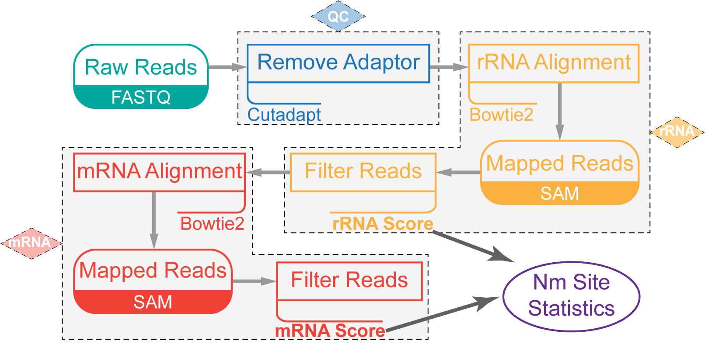

# NJU-seq

----

**N**m site **J**udged **U**niversally **seq**uencing.  
From clean data to positions with 2-*O*-methylation.



## 1. Preparation

#### Install packages and software.

Software managed by [brew](https://brew.sh/).

```shell script
# generic tools
brew install parallel pigz

# bioinformatics tools
brew install bowtie2
brew install picard-tools samtools
```

Perl packages:

```shell script
cpanm YAML::Syck AlignDB::IntSpan PerlIO::gzip Algorithm::Combinatorics
```

*To install PerlIO::gzip on [WSL2](https://devblogs.microsoft.com/commandline/announcing-wsl-2/), you might need to
install [`zlib.h`](http://www.zlib.net/) manually.*

R packages needed:
`ggplot2` `ggpubr` `gridExtra` `forcats` `dplyr` `VennDiagram` `splines` `RColorBrewer` `extrafont` `reshape2`

Make new folders for analysis.

```shell script
# NJU_seq_analysis is the main directory of the following analysis. It can be renamed as you like.
mkdir "NJU_seq_analysis"
cd "NJU_seq_analysis" || exit
git clone https://github.com/IvanWoo22/NJU_seq_open.git
# NJU_seq now is still private online.
mkdir "data" "index" "temp" "output"
```

## 2. Reference and index.

#### Build index

Create index by `bowtie2-build` for mapping.

```shell script
THREAD=16

# Mouse rRNA index
cat NJU_seq_open/data/mmu_rrna/* >data/mmu_rrna.fa
bowtie2-build data/mmu_rrna.fa index/mmu_rrna
rm data/mmu_rrna.fa

# MHV genome index
bowtie2-build NJU_seq_open/data/MHV.fa index/mhv
```

## 3. Data Selection and quality overview.

#### Select data for analysing.

Get the sequencing clean data from `NJU_data`.  
*The representation of `PREFIX` can be found in [`sample_list.csv`](/sample_list.csv).*

```shell script
PREFIX='NJU6394'

mkdir -p "data/${PREFIX}" "temp/${PREFIX}" "output/${PREFIX}"
# SAMN20605472 
cutadapt -O 6 -m 10 -e 0.1 --discard-untrimmed -j 16 \
-a AGATCGGAAGAGCACACGTCTGAACTCCAGTCAC \
-A GATCGTCGGACTGTAGAACTCTGAACGTGTAGAT \
-o data/${PREFIX}/R1.fq.gz \
-p data/${PREFIX}/R2.fq.gz \
PATH_TO_RAW_DATA/${PREFIX}_R1.fq.gz \
PATH_TO_RAW_DATA/${PREFIX}_R2.fq.gz
```

## 4. Alignment, Count and Score

#### Mouse rRNA workflow

Use `bowtie2` to align the data file.

```shell script
THREAD=16
PREFIX='NJU6394'

bowtie2 -p ${THREAD} -a -t \
  --end-to-end -D 20 -R 3 \
  -N 0 -L 10 -i S,1,0.50 --np 0 \
  --xeq -x index/mmu_rrna \
  -1 data/${PREFIX}/R1.fq.gz -2 data/${PREFIX}/R2.fq.gz \
  -S output/${PREFIX}/rrna.raw.sam \
  2>&1 |
  tee output/${PREFIX}/rrna.bowtie2.log

perl NJU_seq_open/tool/stat_alignment.pl \
  output/${PREFIX}/rrna.bowtie2.log |
  Rscript NJU_seq_open/tool/draw_table.R \
  output/${PREFIX}/rrna.bowtie2.pdf
```

Filter and count alignment result.

```shell script
THREAD=16
PREFIX='NJU6394'

samtools view -h -f 97 -F 144 output/${PREFIX}/rrna.raw.sam > output/${PREFIX}/rrna.temp.sam
samtools view -f 145 -F 96 output/${PREFIX}/rrna.raw.sam >> output/${PREFIX}/rrna.temp.sam
samtools sort -n output/${PREFIX}/rrna.temp.sam | samtools view >output/${PREFIX}/rrna.filter.sam
rm output/${PREFIX}/rrna.temp.sam
pigz output/${PREFIX}/rrna.raw.sam

time awk '$6!="*"&&$7=="="{print $1 "\t" $3 "\t" $4 "\t" $6 "\t" $10}' output/${PREFIX}/rrna.filter.sam |
perl NJU_seq_open/rrna_analysis/matchquality_judge.pl |
perl NJU_seq_open/rrna_analysis/multimatch_judge.pl >temp/${PREFIX}/rrna.out.tmp
```

#### Prepare for viral RNA.

Extract reads can't be mapped to mouse rRNA.

```shell script
PREFIX='NJU6394'

bash NJU_seq_open/tool/extract_fastq.sh \
  temp/${PREFIX}/rrna.out.tmp \
  data/${PREFIX}/R1.fq.gz data/${PREFIX}/R1.rrnafiltered.fq.gz \
  data/${PREFIX}/R2.fq.gz data/${PREFIX}/R2.rrnafiltered.fq.gz
```

#### viral RNA workflow

Alignment with MHV genome.

```shell script
THREAD=16
PREFIX='NJU6394'

bowtie2 -p ${THREAD} -a -t \
  --end-to-end -D 20 -R 3 \
  -N 1 -L 10 -i S,1,0.50 --np 0 \
  --xeq -x index/mhv \
  -1 data/${PREFIX}/R1.rrnafiltered.fq.gz -2 data/${PREFIX}/R2.rrnafiltered.fq.gz \
  -S output/${PREFIX}/mhv.raw.sam \
  2>&1 |
  tee output/${PREFIX}/mhv.bowtie2.log
```

Filter and count alignment result.

```shell script
THREAD=16
PREFIX='NJU6394'

samtools view -h -f 97 -F 144 output/${PREFIX}/mhv.raw.sam > output/${PREFIX}/mhv.temp.sam
samtools view -f 145 -F 96 output/${PREFIX}/mhv.raw.sam >> output/${PREFIX}/mhv.temp.sam
samtools sort -n output/${PREFIX}/mhv.temp.sam | samtools view >output/${PREFIX}/mhv.filter.sam
rm output/${PREFIX}/mhv.temp.sam
pigz output/${PREFIX}/mhv.raw.sam

time awk '$6!="*"&&$7=="="{print $1 "\t" $3 "\t" $4 "\t" $6 "\t" $10}' output/${PREFIX}/mhv.filter.sam |
perl NJU_seq_open/rrna_analysis/matchquality_judge.pl |
perl NJU_seq_open/rrna_analysis/multimatch_judge.pl >temp/${PREFIX}/mhv.out.tmp

perl NJU_seq_open/rrna_analysis/readend_count.pl \
  NJU_seq_open/data/MHV.fa temp/${PREFIX}/mhv.out.tmp "NC_048217.1" \
  >output/${PREFIX}/mhv.tsv
```

*You have to process the other samples in the same group according to the above code box. Here NJU6394-6397 are in one
group as `Mmu-N2A-MHV-RF-NC` `Mmu-N2A-MHV-RF-1` `Mmu-N2A-MHV-RF-2` `Mmu-N2A-MHV-RF-3`.*

Score for each site on the MHV genome.

```shell script
perl NJU_seq_open/vrna_analysis/score.pl \
  output/NJU6394/mhv.tsv \
  output/NJU6395/mhv.tsv \
  output/NJU6396/mhv.tsv \
  output/NJU6397/mhv.tsv \
  >output/Mmu_N2A_MHV_scored.tsv
```

* `Mmu_N2A_MHV_scored.tsv` is the score list of each site. *